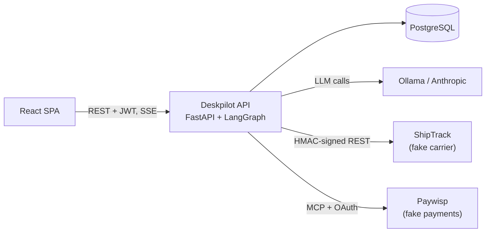

# Deskpilot

A production-style AI support agent for **Acme Gear**, a fictional online shop.

Customers submit support tickets. The agent investigates them with tools — orders,
shipping, refund policy, payments — proposes an action, and pauses for human
approval before anything that costs money or reaches a customer.

The point of the project is everything around the agent. A ReAct loop is twenty
lines; making one safe to point at real money, real customer data, and text written
by strangers is the actual work.

## What it demonstrates

|                       |                                                                                    |
|-----------------------|------------------------------------------------------------------------------------|
| **Agent**             | Hand-built LangGraph ReAct loop, multiple tools, persistent state, step budgets    |
| **Reliability**       | Timeouts, retries, circuit breakers, loop detection, graceful escalation           |
| **Human-in-the-loop** | Graph interrupts, an approval queue, approve / edit / reject, resume after restart |
| **Auth**              | bcrypt passwords, JWT access and refresh tokens with rotation and reuse detection  |
| **Authorization**     | An attribute-based policy engine, deny by default, with an audit log               |
| **Integrations**      | A REST vendor with HMAC request signing, and an MCP vendor behind OAuth 2.1 + PKCE |
| **Security**          | Prompt-injection defenses, read-only agent credentials, output sanitization        |
| **Observability**     | Cross-service tracing, per-user token and cost accounting                          |
| **Quality**           | Unit, graph, integration and end-to-end tests; an eval suite with an LLM judge     |
| **Portability**       | Local models via Ollama, switchable to Anthropic per model role by configuration   |

## Status

**Milestone 1 of 14 complete.** The agent answers questions about a customer's own
orders, using a real tool against a real database, on a local model.

See the [roadmap](docs/roadmap.md) for what's next.

## Try it

Full instructions are in the [setup guide](docs/guides/setup.md). Once it's running:

```console
$ uv run deskpilot ask "Hi, where is my order ORD-1042?" --as noah.kim@example.com -v
Your Trailhead 35L Backpack and two Canyon bottles shipped on 5 September, and the
tracking number is ST-100042. The order total was 177.00 USD. Let me know if you'd
like me to look into anything else.

[2 model call(s) | tools: get_order | tokens: 1183 in, 84 out]
```

Ask about somebody else's order and the agent can't see it, no matter how the
question is phrased:

```console
$ uv run deskpilot ask "What's the status of ORD-1001?" --as noah.kim@example.com
I couldn't find an order with that number on your account. Could you double-check
the number for me?
```

That isn't the model being careful. The acting customer is passed to tools outside
the conversation entirely, so there's no text the model could produce that would
reach another account's data. See [where identity lives](docs/guides/agent.md#where-identity-lives).

## Architecture



Both vendors run as separate services with their own databases and secrets, so the
integrations are honest rather than simulated in-process. The full design is in the
[architecture overview](docs/architecture/overview.md).

## Stack

Python 3.13, uv, LangGraph, LangChain, FastAPI, PostgreSQL, SQLAlchemy, Alembic,
pytest, Ollama, React and TypeScript.

## Documentation

- [Setup guide](docs/guides/setup.md) — get a machine running from zero
- [Agent guide](docs/guides/agent.md) — the graph, tools, and identity
- [Architecture overview](docs/architecture/overview.md) — the whole system
- [Decision log](docs/decisions.md) — why it's built this way
- [All documentation](docs/README.md)

## License

[MIT](LICENSE)