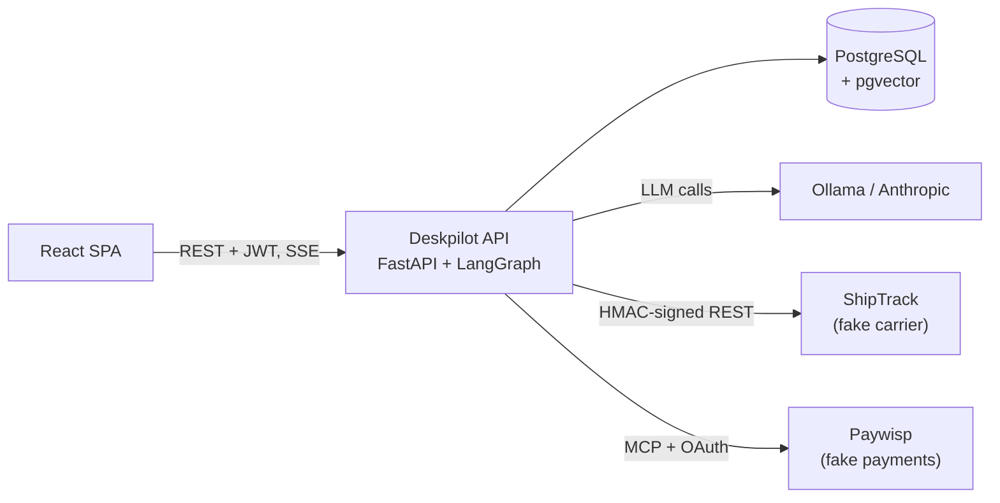

# Deskpilot

A production-style AI support agent for **Acme Gear**, a fictional online shop.

Customers submit support tickets. The agent investigates them with tools — orders,
shipping, refund policy, payments — proposes an action, and pauses for human
approval before anything that costs money or reaches a customer.

The point of the project is everything around the agent. A ReAct loop is twenty
lines; making one safe to point at real money, real customer data, and text written
by strangers is the actual work.

## What it demonstrates

| | |
|---|---|
| **Agent** | Hand-built LangGraph ReAct loop, multiple tools, persistent state, step budgets |
| **Reliability** | Timeouts, retries, circuit breakers, loop detection, graceful escalation |
| **Human-in-the-loop** | Graph interrupts, an approval queue, approve / edit / reject, resume after restart |
| **Auth** | bcrypt passwords, JWT access and refresh tokens with rotation and reuse detection |
| **Authorization** | An attribute-based policy engine, deny by default, with an audit log |
| **Integrations** | A REST vendor with HMAC request signing, and an MCP vendor behind OAuth 2.1 + PKCE |
| **Security** | Prompt-injection defenses, read-only agent credentials, output sanitization |
| **Observability** | Cross-service tracing, per-user token and cost accounting |
| **Quality** | Unit, graph, integration and end-to-end tests; an eval suite with an LLM judge |
| **Portability** | Local models via Ollama, switchable to Anthropic per model role by configuration |

## Status

**Milestones 1 to 4 of 14 complete.** The agent holds a multi-turn conversation
about a customer's own orders, retrieves the shop's published policies from a vector
index, labels each ticket, and is measured by a small eval suite. People log in with
a real password and a real session, every tool asks an attribute-based policy engine
before it answers, and every refusal is recorded. Everything runs on a local model.

See the [roadmap](docs/roadmap.md) for what's next.

## Try it

Full instructions are in the [setup guide](docs/guides/setup.md). Once it's running:

```console
$ uv run deskpilot auth login kenji.tanaka@example.com
Password:
Logged in. Session saved to ~/.deskpilot/session.json.

$ uv run deskpilot ticket new "The zip on my tent broke after a few trips" \
      --subject "Broken zip" --verbose
Opened TCK-0001.

Sorry to hear about the zip. Acme Gear covers manufacturing defects for two years
from delivery, so your Ridgeline tent from August is still within that. If you send
me a photo of the fault, a colleague will follow up on a replacement.

[warranty | 3 model call(s) this turn | tools: get_order, search_policy | ticket tokens: 4182 in, 196 out]
```

The conversation is checkpointed in PostgreSQL, so replying is a separate process
picking it back up:

```console
$ uv run deskpilot ticket reply TCK-0001 "It was a gift, do I need the receipt?"
```

Ask about somebody else's order and the agent can't see it, no matter how the
question is phrased:

```console
$ uv run deskpilot ask "What's the status of ORD-1001?"
I couldn't find an order with that number on your account. Could you double-check
the number for me?
```

That isn't the model being careful. The acting customer is passed to tools outside
the conversation entirely, so there's no text the model could produce that would
reach another account's data. See [where identity lives](docs/guides/agent.md#where-identity-lives).

## Measuring changes

Behaviour is checked by a small eval suite rather than by impression:

```console
$ uv run deskpilot eval run
pass  order-by-number
FAIL  gold-tier-window
        answer is missing '60'
        tools: ['search_policy']

15/16 passed  |  0 critical  |  category 16/16  |  24118 tokens  |  71.4s  |  agent qwen3.6:35b
```

Critical failures — a forbidden tool, a leaked string — are counted separately from
quality regressions. See the [evals guide](docs/guides/evals.md).

## Architecture



Both vendors run as separate services with their own databases and secrets, so the
integrations are honest rather than simulated in-process. The full design is in the
[architecture overview](docs/architecture/overview.md).

## Stack

Python 3.13, uv, LangGraph, LangChain, FastAPI, PostgreSQL with pgvector,
SQLAlchemy, Alembic, pytest, Ollama, React and TypeScript.

## Documentation

- [Setup guide](docs/guides/setup.md) — get a machine running from zero
- [Agent guide](docs/guides/agent.md) — the graph, tools, and identity
- [Evals guide](docs/guides/evals.md) — how behaviour is measured
- [Authentication guide](docs/guides/auth.md) — accounts, passwords, tokens, sessions
- [API guide](docs/guides/api.md) — the HTTP layer
- [Architecture overview](docs/architecture/overview.md) — the whole system
- [Decision log](docs/decisions.md) — why it's built this way
- [All documentation](docs/README.md)

## License

[MIT](LICENSE)
