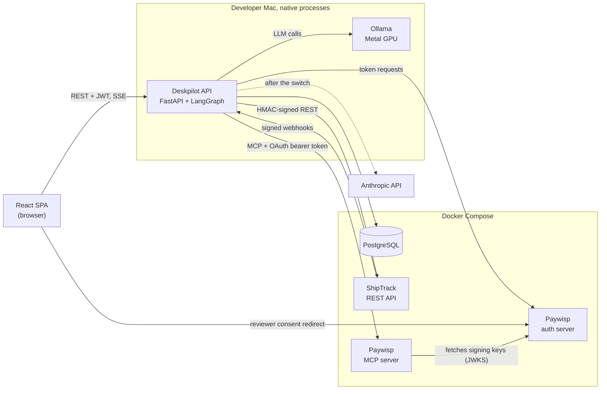
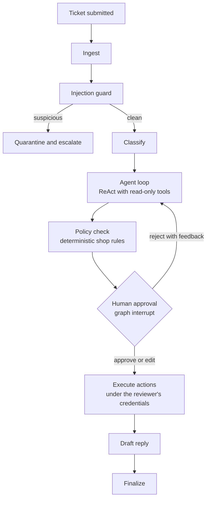

# Architecture overview

> Describes the target design. Parts not built yet are listed in the [roadmap](../roadmap.md).
> Last updated: milestone 1, step 1.5.

## What Deskpilot does

A customer submits a support ticket, for example "my order never arrived, I want my money back." The agent reads it,
looks up the customer and order, checks shipping status with the carrier, consults the refund policy, and decides what
to do: reply with information, issue a refund, send a replacement, or escalate to a human. Anything that costs money or
contacts the customer waits for a human reviewer to approve it.

## System context



## Components

| Component         | Role                                                                                                                            |
|-------------------|---------------------------------------------------------------------------------------------------------------------------------|
| **Deskpilot API** | FastAPI app. Authenticates users, enforces ABAC, runs the LangGraph agent as background tasks, streams agent progress over SSE. |
| **React SPA**     | Customer portal, reviewer console, admin pages, trace viewer, eval dashboard.                                                   |
| **PostgreSQL**    | Users, shop data, audit log, encrypted vendor tokens, LangGraph checkpoints.                                                    |
| **Ollama**        | Local LLM and embedding models. Runs natively for GPU access.                                                                   |
| **Anthropic API** | Optional provider, switched per model role by configuration.                                                                    |
| **ShipTrack**     | Fake shipping carrier. Separate service with its own database and secrets.                                                      |
| **Paywisp**       | Fake payment processor: an OAuth authorization server plus an MCP server.                                                       |

The fake vendors behave like separate companies: they share no database, code, or secrets with Deskpilot.

## Users

| User                 | Can do                                                                             |
|----------------------|------------------------------------------------------------------------------------|
| **Customer**         | Submit tickets; see only their own tickets and orders.                             |
| **Support reviewer** | Approve, edit, or reject proposed actions within their approval limit and regions. |
| **Supervisor**       | Handle high-value approvals and escalations.                                       |
| **Admin**            | Manage users and attributes; view traces, vendor health, and eval results.         |

## Ticket lifecycle

Each ticket is one LangGraph thread with its own checkpoint, so a ticket waiting for approval survives restarts and
resumes exactly where it stopped.



If the approving reviewer hasn't connected their Paywisp account, or their token has expired, the graph pauses in a
`needs_vendor_auth` state instead of failing, and resumes after they reconnect.

## Authentication patterns

| Connection                            | Mechanism                                                                                                     |
|---------------------------------------|---------------------------------------------------------------------------------------------------------------|
| User → Deskpilot                      | Password (bcrypt) login; short-lived JWT access token in memory, rotating refresh token in an httpOnly cookie |
| Deskpilot → ShipTrack                 | API key with HMAC-SHA256 request signing, timestamp, and nonce                                                |
| ShipTrack → Deskpilot                 | Webhooks signed the same way, verified with constant-time comparison and replay protection                    |
| Deskpilot → Paywisp (agent reads)     | OAuth client credentials; token has read scopes only                                                          |
| Deskpilot → Paywisp (approved writes) | OAuth authorization code with PKCE; each reviewer's own delegated token with write scope                      |

Tokens are always issued for a specific audience. Deskpilot never forwards a user's JWT to a vendor.

## Security layers

No single layer is trusted to stop an attack. A refund must pass all of these:

1. **Injection guard and spotlighting.** Untrusted text (tickets, vendor responses) is screened and clearly labeled as
   data, not instructions.
2. **Identity outside the model.** The acting user is passed to tools through LangGraph's typed context. The model can't
   see or change it. *(Built: see the [agent guide](../guides/agent.md#where-identity-lives).)*
3. **ABAC in every tool.** A tool can only reach data the acting user is allowed to see.
4. **Read-only credentials for the agent.** The autonomous loop holds no token that can move money.
5. **Deterministic policy engine.** Shop rules, such as refund caps, are checked in code, regardless of what the model
   says.
6. **Human approval with ABAC on the approver.** The reviewer must be allowed to approve this amount, in this region,
   and not on their own ticket.
7. **Vendor-side checks.** Paywisp independently enforces scopes and limits.
8. **Output sanitization.** Model output rendered in the browser is sanitized, and external images are blocked to
   prevent data exfiltration.

## Model roles

| Role            | Local (Ollama)                        | Later (Anthropic)  |
|-----------------|---------------------------------------|--------------------|
| Agent           | `qwen3.6:35b`                         | `claude-sonnet-5`  |
| Injection guard | `qwen3.6:35b` (shared with the agent) | `claude-haiku-4-5` |
| Eval judge      | `gpt-oss:20b`                         | `claude-opus-5`    |
| Embeddings      | `nomic-embed-text`                    | stays on Ollama    |

See [the Ollama guide](../guides/ollama.md) for memory planning and
the [configuration reference](../reference/configuration.md) for switching.

## Repository layout

Target layout. So far `backend/` has config, the model factory, the database layer, the agent graph with its first tool,
and the CLI; `infra/`, `scripts/`, and `docs/` exist too.

```
deskpilot/
├── docker-compose.yml  # local infrastructure
├── backend/            # Deskpilot API and agent (uv project)
│   ├── migrations/     # Alembic
│   └── src/deskpilot/
│       ├── api/  auth/  authz/  db/  graph/  tools/  guards/
│       ├── integrations/   # ShipTrack client, MCP client, token vault
│       ├── tracing/  llm.py  config.py  cli.py
├── frontend/           # React + TypeScript (pnpm)
├── vendors/
│   ├── shiptrack/      # fake carrier (separate uv project)
│   └── paywisp/        # fake payments: auth_server/ and mcp_server/
├── evals/
├── e2e/                # Playwright
├── infra/              # infrastructure config, e.g. PostgreSQL init scripts
├── scripts/            # developer scripts, e.g. ollama-serve.sh
└── docs/
```
