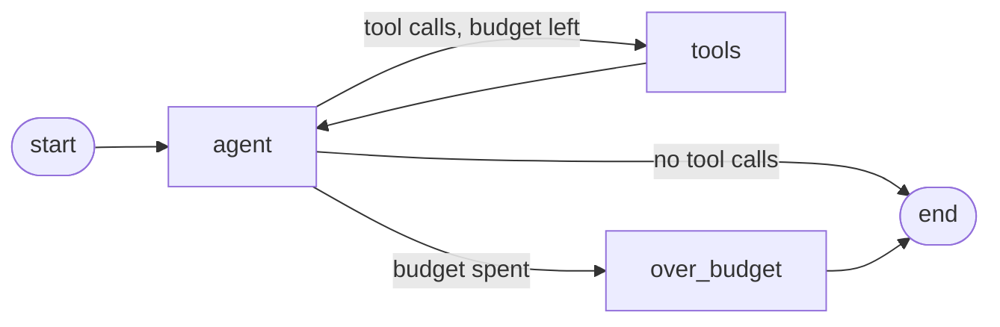

# Agent guide

How the agent works, how to run it, and how to add to it.

> Last verified against: milestone 1 (complete).

## What the agent can do today

Answer a customer's question about their own orders. It is a ReAct loop with one
read-only tool. Refunds, replacements, shipping lookups, human approval, and the
injection guard all arrive in later milestones; see the [roadmap](../roadmap.md).

## Running it

From `backend/`, with Ollama and PostgreSQL running and the shop seeded:

```bash
uv run deskpilot ask "Hi, where is my order ORD-1042?" --as noah.kim@example.com --verbose
```

`--as` is the signed-in customer. Until the auth milestone there is no login, so the
CLI states the identity directly; the agent still sees only that person's data.
`--verbose` adds a line with the number of model calls, the tools called, and token
usage.

Things worth trying:

| Command                                                   | What it shows                       |
|-----------------------------------------------------------|-------------------------------------|
| `ask "where is ORD-1042?" --as noah.kim@example.com`      | A normal lookup                     |
| `ask "what about ORD-1001?" --as noah.kim@example.com`    | Another customer's order: not found |
| `ask "what about ORD-1001?" --as ana.garcia@example.com`  | The same order, for its owner       |
| `ask "hello, are you a human?" --as noah.kim@example.com` | An answer with no tool call         |

## The graph



| Node          | What it does                                                       |
|---------------|--------------------------------------------------------------------|
| `agent`       | Calls the model once with the tools bound, and records token usage |
| `tools`       | LangGraph's `ToolNode`: runs the requested tool calls              |
| `over_budget` | Ends the run with a message saying a colleague will follow up      |

The loop is written by hand rather than with `create_react_agent`, because every
later milestone attaches to it: a guard before it, a policy check after it, an
approval interrupt before side effects ([D-023](../decisions.md#d-023-the-loop-is-hand-built-tool-plumbing-is-not)).

### State

`AgentState` is what gets checkpointed. Reducers decide how a node's return value
merges in, so nodes return deltas rather than new totals.

| Field                           | Reducer        | Purpose                                                 |
|---------------------------------|----------------|---------------------------------------------------------|
| `messages`                      | `add_messages` | The conversation, appended to and updated by message id |
| `steps`                         | `operator.add` | Model calls so far; bounds the loop                     |
| `input_tokens`, `output_tokens` | `operator.add` | Usage for the run                                       |

The system prompt is prepended on every model call and never stored in state, so
nothing that appends to the conversation can push it out or edit it away.

### The step budget

A run may call the model at most `DESKPILOT_MAX_AGENT_STEPS` times (6 by default).
This is the floor for loop safety, not the finished behaviour: detecting repeated
identical calls, per-call timeouts, and retries come with the resilience milestone.

## Where identity lives

The single most important property of the design: **the model never sees who it is
acting for.**

```
AgentContext  ──►  graph.ainvoke(..., context=...)  ──►  ToolRuntime  ──►  tool
     (email, session factory)                                   never into messages
```

`AgentContext` is passed as LangGraph's typed context. It is not part of state, not
part of the message list, and not checkpointed. Tools declare a `runtime:
ToolRuntime[AgentContext]` parameter and LangGraph injects it; that parameter is
excluded from the schema the model sees, so the model supplies only business
arguments such as an order number.

The consequence is that no prompt injection can make the agent act as a different
customer. There is no token sequence that reaches the context.

From the ABAC milestone onwards, this same context carries a full principal with
attributes, and every tool checks it.
See [D-020](../decisions.md#d-020-identity-travels-in-the-graph-context-never-in-state).

## Tools

Tools live in `src/deskpilot/tools/` and are registered in `ALL_TOOLS`.

### Rules every tool follows

- **The model passes business arguments only.** Identity and dependencies come from
  the context.
- **Return text written for the model,** not raw rows. The tool decides what the
  model is allowed to know.
- **Enforce ownership in the query,** so out-of-scope rows are never loaded.
- **Give one answer for "does not exist" and "not yours",** so the agent cannot be
  used to probe which identifiers are real
  ([D-021](../decisions.md#d-021-not-found-and-not-yours-give-the-same-answer)).
- **Leave untrusted text out** until the security milestone. `orders.notes` is typed
  by customers and stays out of tool output for now
  ([D-022](../decisions.md#d-022-untrusted-customer-text-is-withheld-from-the-model-for-now)).
- **Write a clear docstring.** It is the description the model sees, and it is the
  main thing that decides whether the tool gets called correctly.

### Current tools

| Tool        | Arguments      | Returns                                                                                 |
|-------------|----------------|-----------------------------------------------------------------------------------------|
| `get_order` | `order_number` | Status, date, tracking number, total, and items for one of the acting customer's orders |

### Adding a tool

1. Write it in `src/deskpilot/tools/`, taking `runtime: ToolRuntime[AgentContext]`
   if it needs identity or the database.
2. Add it to `ALL_TOOLS` in `src/deskpilot/tools/__init__.py`.
3. Unit-test the pure parts, such as formatting.
4. Integration-test the database access, including that another customer's data
   cannot be reached. `tests/support.invoke_tool` runs a tool with its context
   injected, exactly as the graph does.
5. Add a graph test if the tool changes how the loop behaves.

## Failure handling

| Failure                             | What happens                                                                                                                                                                                                                                                     |
|-------------------------------------|------------------------------------------------------------------------------------------------------------------------------------------------------------------------------------------------------------------------------------------------------------------|
| A tool raises                       | The model gets a fixed instruction to report the failure and not retry. The exception is logged server-side only, because its text can contain hostnames and connection strings ([D-025](../decisions.md#d-025-tool-exceptions-never-reach-the-model-verbatim)). |
| The model invents a tool name       | `ToolNode` returns an error message listing the real tools, and the run continues.                                                                                                                                                                               |
| The model sends malformed arguments | Same: an error message goes back and the model can correct itself.                                                                                                                                                                                               |
| The model keeps calling tools       | The step budget ends the run with an escalation message.                                                                                                                                                                                                         |

In every case the run finishes with something to say to the customer. Nothing
crashes.

## Tests

| Suite                | Speed              | Needs              | Covers                                                       |
|----------------------|--------------------|--------------------|--------------------------------------------------------------|
| `tests/unit/`        | milliseconds       | nothing            | Pure functions, such as how an order is rendered             |
| `tests/graph/`       | milliseconds       | nothing            | The loop, routing, budget, error handling, context injection |
| `tests/integration/` | seconds to minutes | Ollama, PostgreSQL | Real tool queries and real end-to-end runs                   |

Graph tests use `ScriptedChatModel` from `tests/support.py`, which returns prepared
responses and records what it was asked. That makes loop behaviour deterministic and
fast to test ([D-026](../decisions.md#d-026-graph-behaviour-is-tested-with-a-scripted-model)).

One trap worth knowing: the scripted model returns a fresh copy of its response with
unique message and tool-call ids each turn. Reusing one message object makes
`add_messages` treat the second turn as an edit of the first, which silently caps the
loop and hides off-by-one errors in the budget.

```bash
uv run pytest tests/graph -q            # loop logic, no services needed
uv run pytest -m integration -k agent   # real model, real database
```

## Prompts

Prompts live in `src/deskpilot/graph/prompts.py`, not scattered through the code, so
they can be diffed, reviewed, and compared across models in the evals milestone.
`STEP_BUDGET_MESSAGE` and `TOOL_FAILURE_MESSAGE` are fixed strings rather than
model-generated text, so behaviour on failure paths is predictable.
