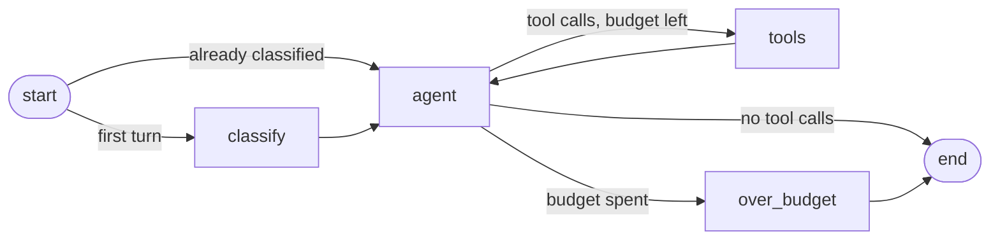

# Agent guide

How the agent works, how to run it, and how to add to it.

> Last verified against: milestone 2, step 2.2.

## What the agent can do today

Hold a conversation with a customer about their own orders. It is a ReAct loop with
one read-only tool, and the conversation persists across turns and across restarts.
Refunds, replacements, shipping lookups, human approval, and the injection guard all
arrive in later milestones; see the [roadmap](../roadmap.md).

## Running it

From `backend/`, with Ollama and PostgreSQL running and the shop seeded.

A ticket is a conversation that is saved and can be picked up later:

```bash
uv run deskpilot ticket new "Hi, where is my order ORD-1042?" \
    --as noah.kim@example.com --subject "Where is my order" --verbose

uv run deskpilot ticket reply TCK-0001 "Thanks. What about ORD-1031?" \
    --as noah.kim@example.com

uv run deskpilot ticket show TCK-0001 --as noah.kim@example.com --tools
uv run deskpilot ticket list
```

Each command is a separate process, so a working `reply` is itself proof that the
conversation was reloaded from PostgreSQL rather than held in memory.

`ask` is the one-shot version. Nothing is saved and no ticket is created, which
makes it the quickest way to try something:

```bash
uv run deskpilot ask "Hi, where is my order ORD-1042?" --as noah.kim@example.com -v
```

`--as` is the signed-in customer. Until the auth milestone there is no login, so the
CLI states the identity directly; the agent still sees only that person's data.
`--verbose` adds a line with the model calls this turn, the tools called, and the
ticket's token usage.

Things worth trying:

| Command | What it shows |
|---|---|
| `ask "where is ORD-1042?" --as noah.kim@example.com` | A normal lookup |
| `ask "what about ORD-1001?" --as noah.kim@example.com` | Another customer's order: not found |
| `ask "what about ORD-1001?" --as ana.garcia@example.com` | The same order, for its owner |
| `ask "hello, are you a human?" --as noah.kim@example.com` | An answer with no tool call |
| `ask "how long do I have to return a tent?" --as noah.kim@example.com -v` | A policy lookup |
| `ask "what is the atomic mass of tungsten?" --as noah.kim@example.com -v` | A question the policy does not cover |
| `ticket show TCK-0001 --as ana.garcia@example.com` | Another customer's ticket: refused |

## Tickets and threads

Every ticket is one LangGraph thread. Its `thread_id` is the key the conversation is
checkpointed under, so the messages live in LangGraph's tables and are not copied
into the `tickets` row ([D-027](../decisions.md#d-027-a-ticket-is-a-langgraph-thread-the-conversation-is-not-duplicated)).

| Status | Meaning |
|---|---|
| `open` | The agent or a human still owes the customer a reply |
| `awaiting_customer` | The agent has replied |
| `escalated` | The agent gave up, e.g. it ran out of steps |
| `resolved` | Closed; a reply starts a new ticket instead |

State is written after every node, so a ticket survives the process stopping at any
point. Reading a conversation back needs no model: `ticket show` reads the
checkpoint directly.

## The graph



| Node | What it does |
|---|---|
| `classify` | Labels the ticket once, on its first turn, with a short structured model call |
| `agent` | Calls the model once with the tools bound, and records token usage |
| `tools` | LangGraph's `ToolNode`: runs the requested tool calls |
| `over_budget` | Ends the run with a message saying a colleague will follow up |

The loop is written by hand rather than with `create_react_agent`, because every
later milestone attaches to it: a guard before it, a policy check after it, an
approval interrupt before side effects ([D-023](../decisions.md#d-023-the-loop-is-hand-built-tool-plumbing-is-not)).

### State

`AgentState` is what gets checkpointed. Reducers decide how a node's return value
merges in, so nodes return deltas rather than new totals.

| Field | Reducer | Purpose |
|---|---|---|
| `messages` | `add_messages` | The conversation, appended to and updated by message id |
| `steps` | none (overwritten) | Model calls in this turn; bounds the loop |
| `input_tokens`, `output_tokens` | `operator.add` | Usage across the whole ticket |
| `escalated` | none (overwritten) | Set when the agent gave up and a human is needed |
| `category` | none (overwritten) | What the ticket is about; set once, on the first turn |

`category` is `NotRequired`, and a turn's input leaves the key out entirely. The
channel has no reducer, so passing `None` each turn would wipe the label the
classifier set. It is also held as a plain string rather than as `TicketCategory`,
because a checkpoint is serialized and a `StrEnum` comes back from it as a `str`
([D-043](../decisions.md#d-043-the-category-is-stored-in-state-as-a-string-not-as-an-enum)).

The system prompt is prepended on every model call and never stored in state, so
nothing that appends to the conversation can push it out or edit it away.

**Reducers are how a turn resumes.** Each turn passes `steps: 0`, which overwrites,
and `input_tokens: 0`, which adds nothing. So the budget restarts while the running
cost keeps climbing ([D-030](../decisions.md#d-030-the-step-budget-resets-each-turn-token-counts-do-not)).

**Message ids matter more than they look.** `add_messages` merges by id, so two
messages sharing an id become one. This bit the scripted test model twice: once when
it returned the same object every turn, and again when two instances in one
conversation both numbered their messages from one. If a reply seems to vanish, look
at ids first.

### The step budget

A run may call the model at most `DESKPILOT_MAX_AGENT_STEPS` times (6 by default).
This is the floor for loop safety, not the finished behaviour: detecting repeated
identical calls, per-call timeouts, and retries come with the resilience milestone.

## Where identity lives

The single most important property of the design: **the model never sees who it is
acting for.**

```
AgentContext  ──►  graph.ainvoke(..., context=...)  ──►  ToolRuntime  ──►  tool
     (email, session factory)                                   never into messages
```

`AgentContext` is passed as LangGraph's typed context. It is not part of state, not
part of the message list, and not checkpointed. Tools declare a `runtime:
ToolRuntime[AgentContext]` parameter and LangGraph injects it; that parameter is
excluded from the schema the model sees, so the model supplies only business
arguments such as an order number.

The consequence is that no prompt injection can make the agent act as a different
customer. There is no token sequence that reaches the context.

From the ABAC milestone onwards, this same context carries a full principal with
attributes, and every tool checks it. See [D-020](../decisions.md#d-020-identity-travels-in-the-graph-context-never-in-state).

## Tools

Tools live in `src/deskpilot/tools/` and are registered in `ALL_TOOLS`.

### Rules every tool follows

- **The model passes business arguments only.** Identity and dependencies come from
  the context. If the context already answers an argument, the argument should not
  exist.
- **Return text written for the model,** not raw rows. The tool decides what the
  model is allowed to know.
- **Enforce ownership in the query,** so out-of-scope rows are never loaded. Tools that read shared reference data, such as `search_policy`, have no owner to check.
- **Give one answer for "does not exist" and "not yours",** so the agent cannot be
  used to probe which identifiers are real ([D-021](../decisions.md#d-021-not-found-and-not-yours-give-the-same-answer)).
- **Leave untrusted text out** until the security milestone. `orders.notes` is typed
  by customers and stays out of tool output for now ([D-022](../decisions.md#d-022-untrusted-customer-text-is-withheld-from-the-model-for-now)).
- **Write a clear docstring.** It is the description the model sees, and it is the
  main thing that decides whether the tool gets called correctly.

### Current tools

| Tool | Arguments | Returns |
|---|---|---|
| `get_order` | `order_number` | Status, date, tracking number, total, and items for one of the acting customer's orders |
| `list_orders` | `status` (optional enum) | One line per order, newest first, capped and honest about it |
| `get_customer` | none | The acting customer's name, region, membership tier, and order count |
| `search_policy` | `question` | The closest passages from the published policies |

Three details worth copying into any tool you add:

- **`get_customer` takes no arguments.** The account it describes comes from the
  context, so there is no parameter through which the model could ask about somebody
  else ([D-037](../decisions.md#d-037-a-tool-takes-no-argument-it-can-get-from-the-context)).
- **`list_orders` says when it truncated.** A model shown ten of fourteen orders
  will otherwise report ten as the total
  ([D-038](../decisions.md#d-038-a-truncated-list-says-that-it-is-truncated)).
- **`status` is an enum, not a string.** The model sees the five valid values and
  cannot invent "in transit"
  ([D-040](../decisions.md#d-040-enum-arguments-are-typed-not-free-text)).
| `search_policy` | `question` | The most relevant passages of Acme Gear's published policies, or a statement that the policy does not cover it. See the [policy knowledge base](policy-search.md). |

### Adding a tool

1. Write it in `src/deskpilot/tools/`, taking `runtime: ToolRuntime[AgentContext]`
   if it needs identity or the database.
2. Add it to `ALL_TOOLS` in `src/deskpilot/tools/__init__.py`.
3. Unit-test the pure parts, such as formatting.
4. Integration-test the database access, including that another customer's data
   cannot be reached. `tests/support.invoke_tool` runs a tool with its context
   injected, exactly as the graph does.
5. Add a graph test if the tool changes how the loop behaves.

## Classification

Every ticket is labelled once, on its first turn: `shipping`, `return_or_refund`,
`warranty`, `order_status`, `product`, or `other`. The label is a short structured
model call, and it is recorded both in graph state and on the ticket row, so
`deskpilot ticket list` can show it.

**The label is advisory.** It is appended to the system prompt as a hedged hint and
nothing more. It does not choose which tools the agent gets. A wrong label should
cost a little answer quality, never the ability to answer at all — and since the
classifier reads customer-written text, the label is something an attacker can
nudge. A hint they can nudge is survivable; a capability switch they can flip is not
([D-042](../decisions.md#d-042-the-category-is-advisory-and-does-not-decide-which-tools-the-agent-gets)).

Classification never fails the run. A model error, a malformed answer, or an empty
message all produce `other` and a warning in the log
([D-045](../decisions.md#d-045-a-failed-classification-degrades-it-does-not-raise)).

Its tokens count towards the ticket, which takes a small deliberate step:
`with_structured_output` is called with `include_raw=True`, because without it the
parsed object is all that comes back and the call's usage is silently lost
([D-044](../decisions.md#d-044-structured-output-keeps-the-raw-message)).

## Failure handling

| Failure | What happens |
|---|---|
| A tool raises | The model gets a fixed instruction to report the failure and not retry. The exception is logged server-side only, because its text can contain hostnames and connection strings ([D-025](../decisions.md#d-025-tool-exceptions-never-reach-the-model-verbatim)). |
| The model invents a tool name | `ToolNode` returns an error message listing the real tools, and the run continues. |
| The model sends malformed arguments | Same: an error message goes back and the model can correct itself. |
| The model keeps calling tools | The step budget ends the run with an escalation message. |
| The classifier fails or answers nonsense | The ticket is labelled `other` and the run continues. |

In every case the run finishes with something to say to the customer. Nothing
crashes.

## Tests

| Suite | Speed | Needs | Covers |
|---|---|---|---|
| `tests/unit/` | milliseconds | nothing | Pure functions, such as how an order is rendered |
| `tests/graph/` | milliseconds | nothing | The loop, routing, budget, error handling, context injection |
| `tests/integration/` | seconds to minutes | Ollama, PostgreSQL | Real tool queries and real end-to-end runs |

Graph tests use `ScriptedChatModel` from `tests/support.py`, which returns prepared
responses and records what it was asked. That makes loop behaviour deterministic and
fast to test ([D-026](../decisions.md#d-026-graph-behaviour-is-tested-with-a-scripted-model)).

One trap worth knowing: the scripted model returns a fresh copy of its response with
unique message and tool-call ids each turn. Reusing one message object makes
`add_messages` treat the second turn as an edit of the first, which silently caps the
loop and hides off-by-one errors in the budget.

```bash
uv run pytest tests/graph -q              # loop and multi-turn logic, no services
uv run pytest -m integration -k tickets   # real checkpoints in PostgreSQL
uv run pytest -m integration -k agent     # real model, real database
```

Multi-turn tests use LangGraph's `InMemorySaver`. The integration tests use the real
PostgreSQL checkpointer and open a second connection pool for the second turn, which
is as close as a test gets to restarting the service.

## Prompts

Prompts live in `src/deskpilot/graph/prompts.py`, not scattered through the code, so
they can be diffed, reviewed, and compared across models in the evals milestone.
`STEP_BUDGET_MESSAGE` and `TOOL_FAILURE_MESSAGE` are fixed strings rather than
model-generated text, so behaviour on failure paths is predictable.
